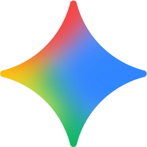

<div align="center">
  
  <h1>✨ Gemini Clone</h1>
  <p><strong>An AI-powered conversational interface built with Next.js, inspired by Google Gemini.</strong></p>
</div>

---

## 📖 Overview

**Gemini Clone** is a highly polished, responsive, and interactive AI chat application designed to replicate the sleek experience of Google Gemini. It seamlessly integrates with the **Google Generative AI API** to provide rich, real-time conversational capabilities.

The project is built emphasizing modern web development practices, featuring a beautiful UI, smooth micro-animations, robust state management, and real-time markdown parsing.

## 🚀 Features

- **Brainpower by Google AI**: Integrated directly with `@google/genai` using the fast `gemini-3-flash-preview` model.
- **Modern UI/UX**: Crafted with the brand-new **Tailwind CSS v4** for a responsive, clean, and beautiful aesthetic.
- **Fluid Animations**: Leveraging **Framer Motion** for elegant transitions and interactive micro-animations.
- **Rich Text Support**: Renders AI responses seamlessly with `react-markdown` and `@tailwindcss/typography`.
- **Typing Effects**: Engaging AI output rendering using `typewriter-effect`.
- **Robust State Management**: Built-in React Context API (`Context.tsx`) for global message tracking and application state control.
- **Next-Gen Framework**: Fully leverages **Next.js 16** and **React 19** features.

## 💻 Tech Stack

| Category         | Technology / Dependency |
|------------------|-------------------------|
| **Framework**    | Next.js (v16.1.6)      |
| **AI provider**  | Google Generative AI    |
| **Styling**      | Tailwind CSS (v4)       |
| **Animations**   | Framer Motion & Typewriter |
| **Icons**        | Lucide React            |
| **Markdown**     | React Markdown          |

## 📁 Project Structure

```text
app/
├── _components/      # Reusable UI components (Sidebar, Chat, Header, Action, etc.)
├── _context/         # Global state management (Context.tsx)
├── config/           # API integration and Google GenAI configurations (config.ts)
├── layout.tsx        # Root layout, fonts, and ContextProvider wrapper
├── page.tsx          # Main entry page assembling the Sidebar, Chat, and Modal
└── globals.css       # Tailwind entry point and global styles
```

## 🛠️ Getting Started

### Prerequisites

Ensure you have [Node.js](https://nodejs.org/) installed along with a package manager (`npm`, `yarn`, `pnpm`, or `bun`).

### 1. Clone the repository

```bash
git clone https://github.com/AbdulrahmanSE2003/gemini-clone.git
cd gemini-clone
```

### 2. Install dependencies

```bash
pnpm install
```
*(Or use `npm install` / `yarn install` depending on your preference).*

### 3. Set up environment variables

Create a `.env.local` file in the root of the project and add your Google Gemini API key:

```env
NEXT_PUBLIC_GEMINI_API_KEY=your_google_gemini_api_key_here
```

### 4. Run the development server

```bash
pnpm run dev
```

Open [http://localhost:3000](http://localhost:3000) with your browser to start chatting with your Gemini Clone!

## 📜 License

This project is open-sourced and available for modifications. Feel free to fork and enhance!
